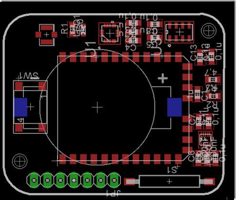
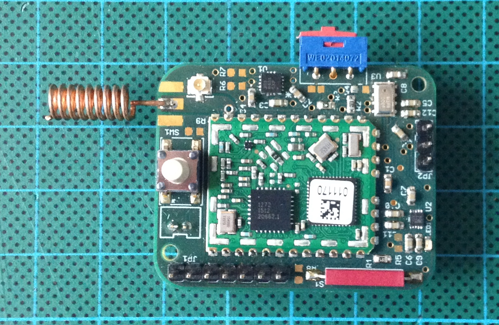
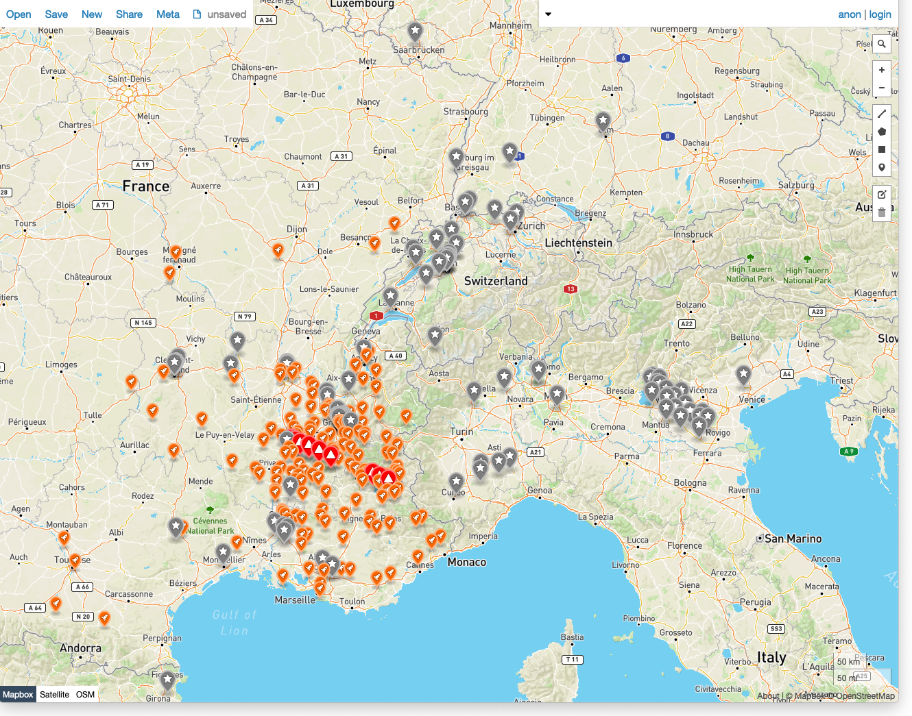
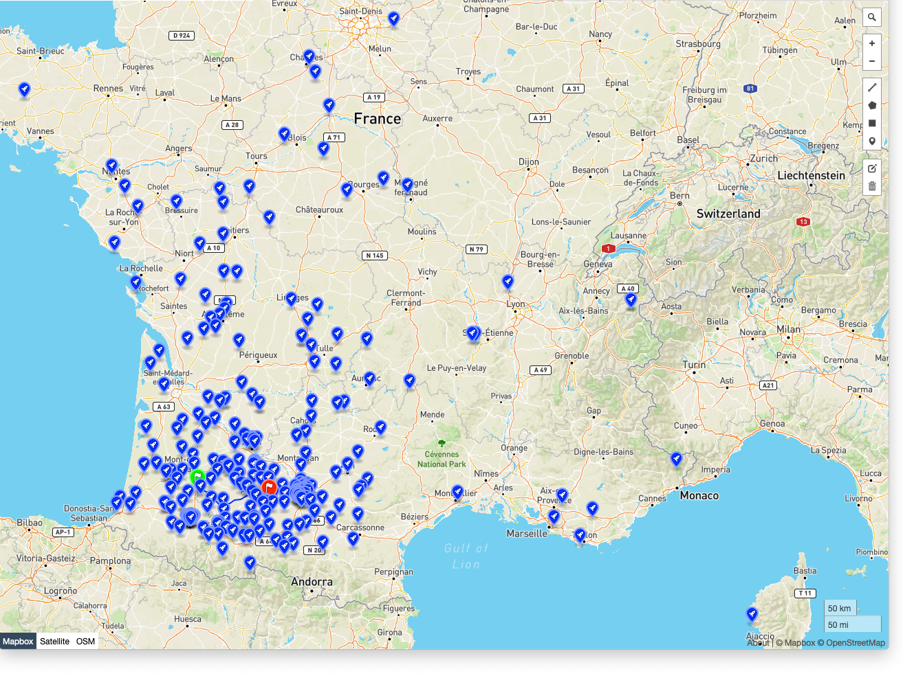

# OrbiMote: open-sourced LoRaWAN balloon tracker

"urbi et orbi" : to the city and the world

The Orbimote is a LoRa/LoRaWAN endpoint
* for tracking sounding balloons
* and for implementing flying repeaters and flying field testers.

# HW & FW
* [Hardware](./hardware)
* [Firmware](./firmware)

## GNSS additional modules for near-space applications

According [CoCom](https://en.wikipedia.org/wiki/CoCom) regulations, most of commercial GPS modules stop at altitudes higher than 18000 meters and for speeds higher than 1000 knots (1852 km/h).

Here is a list of GPS modules : [gnss_modules.md](./gnss_modules.md)

## Barometers for near-space applications

Here is a list of barometer components and modules : [barometers.md](./barometers.md)

## Flights

[High-altitude flights](https://gricad-gitlab.univ-grenoble-alpes.fr/thingsat/public/-/blob/master/balloons)

### 2019
Valence, May 2019. [more](https://gricad-gitlab.univ-grenoble-alpes.fr/thingsat/public/-/blob/master/balloons/2019-05-09/README.md)

Legend: The balloon track (in red), Orange Liveobject stations (in orange), TTN stations (in grey)
### 2020
Aire-sur-l'Adour, September 2020. [more](https://gricad-gitlab.univ-grenoble-alpes.fr/thingsat/public/-/blob/master/balloons/2020-09-23/README.md)

Legend: The balloon track (in green for departure, blue line and red for arrival), Orange Liveobject stations (in blue)

### 2021
Aire-sur-l'Adour, April 2021. [more](https://gricad-gitlab.univ-grenoble-alpes.fr/thingsat/public/-/blob/master/balloons/2021-04-15/README.md)

Legend: The 3 balloons tracks (in green for departure, red for arrival), Orange Liveobject stations in orange, Requea stations in blue, Swisscom (thru Actility) in red.

## Altenatives
* [HAB2 High Altitude Balloon Tracker RFM9x](https://github.com/StuartsProjects/HAB2)

## Other usagers
* Runners trackers
* Meshed-network of trail runners/trekers

## License
TBD

## Authors
* Didier DONSEZ
* Vivien QUEMA
* Gregory NOCERA
