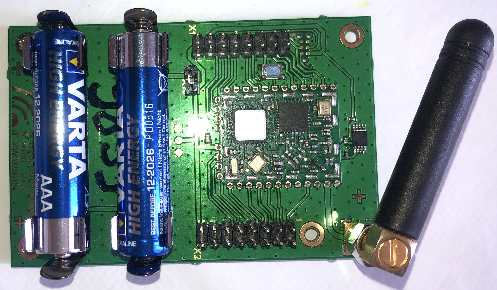

# Field Test Device

## Field Test Device

The program sends periodically LoRaWAN frames at various datarate and tx power.

If a NMEA0183 GNSS module is plugged onto the board, the postion is sent into each LoRaWAN frames. See the list of [NMEA0183 GNSS module](../gnss_modules.md).

Uplink frames can be confirmed or unconfirmed by the network server.

The RTC of the board can be synchronized according to the [App Clock Sync Specification](https://lora-alliance.org/resource-hub/lorawanr-application-layer-clock-synchronization-specification-v100).

## Payload format

	fPort : 2 to 99
	
	uint8 : txpower (2,5,8,11,14)
	uint8 : datarate (0,1,2,3,4,5)
	int16 : temperature in 0.01 °C
	int24 : latitude
	int24 : longitude
	int16 : altitude

> The paylaod will include in a future version the following fields : downlink message counter (uint16_t), last downlink fCnt (uint16_t), last downlink RSSI (uint8_t), last downlink LSNR (int8_t) and GPIO_IN bitfield (uint8_t)


## Boards

Board:
* [x] [boards/im880b](https://github.com/RIOT-OS/RIOT/tree/master/boards/im880b)
* [x] [nucleo-f446re](https://github.com/RIOT-OS/RIOT/tree/master/boards/nucleo-f446re) + [P-NUCLEO-LRWAN1](https://www.st.com/en/evaluation-tools/p-nucleo-lrwan1.html)
* [x] [nucleo-f446re](https://github.com/RIOT-OS/RIOT/tree/master/boards/nucleo-f446re) + [SX1276MB1xAS](https://os.mbed.com/components/SX1276MB1xAS/) for eu433 and eu868
* [ ] [boards/b-l072z-lrwan1](https://github.com/RIOT-OS/RIOT/tree/master/boards/b-l072z-lrwan1)
* [ ] [STM32WL55](https://github.com/RIOT-OS/RIOT/tree/master/boards/nucleo-stm32wl55)
* [ ] [ESP32 Heltec LoRa](https://github.com/RIOT-OS/RIOT/tree/master/boards/esp32-heltec-lora32-v2)
* [ ] [ESP32 TTGO Beam](https://github.com/RIOT-OS/RIOT/blob/master/boards/esp32-ttgo-t-beam)
* [ ] [Bluepill](https://github.com/RIOT-OS/RIOT/tree/master/boards/bluepill-stm32f030c8) + [RFM9x](https://learn.adafruit.com/adafruit-rfm69hcw-and-rfm96-rfm95-rfm98-lora-packet-padio-breakouts/arduino-wiring)

### Default board
The IMST iM880a board is a simple prototyping board with an IMST IMST iM880a LoRa module 
a DS75LX temperature sensor. A [NMEA0183 GNSS module](../gnss_modules.md) can be added on the pin xx of connector X2

<p align="center">

</p>

## Libraries

Drivers:
* [drivers/ds75lx](https://github.com/RIOT-OS/RIOT/tree/master/drivers/ds75lx)

GPS modules:
* [See notes](../gnss_modules.md)


## Build and flash

Connect the X1 and X2 connectors according to the wiring despicted in the annexes.

By default, the DevEUI, the AppEUI and the AppKey are forged using the CPU ID of the MCU. However, you can set the DevEUI, the AppEUI and the AppKey of the LoRaWAN endpoint into the `main.c`.

Optional : Configure the following parameters into the program file `main.c` : `FIRST_TX_PERIOD`, `TX_PERIOD`, `DR_INIT`, `ADR_ON`, `DEBUG_ON` and `SECRET`.

Register the endpoint into a LoRaWAN network (public or private) using the DevEUI, the AppEUI and the AppKey

Build the firmware
```bash
export RIOTBASE=~/github/RIOT-OS/RIOT
(cd $RIOTBASE; git checkout 6bf6b6be6c4723b49f62550a35111e57b7426aa4) 
make binfile
```

Connect the board to the STLink according this [tutorial](https://github.com/CampusIoT/tutorial/tree/master/im880a) and then flash the firmware
```bash
export RIOTBASE=~/github/RIOT-OS/RIOT
make flash-only
```


## Enable/Disable the region duty cycle

The region duty cycle can be enabled or disabled in the region file in `bin/pkg/im880b/semtech-loramac/src/mac/region`.

For instance, `RIOT-OS/RIOT/build/pkg/semtech-loramac/src/mac/region/RegionEU868.h` for region `EU868`

Enable region duty cycle
```c
#define EU868_DUTY_CYCLE_ENABLED                    1
```

Disable region duty cycle
```c
#define EU868_DUTY_CYCLE_ENABLED                    0
```

## Console
Connect the board TX pin to USBSerial port and then configure and start `minicom` or `Pyterm`.

```bash
ll /dev/tty.*
make term
```

or

```bash
ll /dev/tty.*
minicom -s
```

## AppKey

The AppKey can be recovered from the DevEUI (displayed at startup) and the SECRET (flashed into the firmware) with the command lines below:

```bash
SECRET=cafebabe02000001cafebabe02ffffff                                         
DevEUI=33323431007f1234                                                         
AppEUI=33323431ffffffff                                                        
SHA=$(echo -n $DevEUI$AppEUI$SECRET | xxd -r -p | shasum -b | awk '{print $1}')
AppKey="${SHA:0:32}"
echo $AppKey
```

## Downlink

The application can send a downlink message to the endpoint throught your network server.

Downlink payload can be used for
* sending an ASCII message (port = 1)
* setting the realtime clock of the endpoint (port = 2)
* setting the tx period of the data (port = 3)

### Setup
For CampusIoT:
```bash
ORGID=<YOUR_ORG_ID>
BROKER=lns.campusiot.imag.fr
MQTTUSER=org-$ORGID
MQTTPASSWORD=<YOUR_ORG_TOKEN>
applicationID=1
devEUI=33323431007f1234
```

### sending an ASCII message
```bash
PORT=1
mosquitto_pub -h $BROKER -u $MQTTUSER -P $MQTTPASSWORD -t "application/$applicationID/device/$devEUI/tx" -m '{"reference": "abcd1234","confirmed": true, "fPort": '$PORT',"data":"SGVsbG8gQ2FtcHVzSW9UICE="}'
```

The output on the console is:
```bash
main(): This is RIOT! (Version: 2020.04-devel-1660-gb535c)
Secret:cafebabe02000001cafebabe02ffffff                                         
DevEUI:33323431007f1234                                                         
AppEUI:33323431ffffffff                                                         
AppKey:f482a62f0f1234ac960882a2e25f971b                                         
Starting join procedure: dr=5                                                   
Join procedure succeeded                                                        
Sending LPP payload with : T: 22.75                                             
Received ACK from network                                                       
Sending LPP payload with : T: 22.75                                             
Data received: Hello CampusIoT !, port: 1                                      
Received ACK from network                                                       
```

### setting the tx period of the data

```bash
PORT=3
mosquitto_pub -h $BROKER -u $MQTTUSER -P $MQTTPASSWORD -t "application/$applicationID/device/$devEUI/tx" -m '{"reference": "abcd1234","confirmed": true, "fPort": '$PORT',"data":"PAA="}'
```
> The new tx period is 60 seconds (3C00)
> The epoch is a unsigned 16 bit-long integer (big endian)

The output on the console is:
```bash
...
Sending LPP payload with : T: 22.75                                
Data received: tx_period=60, port: 3                                            
Received ACK from network                                                       
```

### Setting the realtime clock of the endpoint
```bash
PORT=202
PAYLOAD=FE0BF6FB4B
mosquitto_pub -h $BROKER -u $MQTTUSER -P $MQTTPASSWORD -t "application/$applicationID/device/$devEUI/tx" -m '{"reference": "abcd1234","confirmed": true, "fPort": '$PORT',"data":"/gv2+0s="}'
```

> The time is the number of seconds since 01/01/1980 (GPS start time). It is unsigned 32 bit-long integer (big endian) LSBF 

The output on the console is:
```bash
...
Received ACK from network                                                                                 
Current RTC time :   2020-05-24 15:03:09                                                                  
Last correction  :   2020-05-24 15:00:49                                                                  
Read temperature= 25.00                                                                                   
app_clock_process_downlink                                                                                
X_APP_CLOCK_CID_AppTimeSetReq                                                                             
Current time    :   2020-05-24 15:03:44                                                                   
RTC time fixed  :   2020-05-24 16:08:43                                                                   
sent_buffer:                                                                                              
```

> Remark: Chirpstack implements the [App Clock Sync Specification](https://lora-alliance.org/resource-hub/lorawanr-application-layer-clock-synchronization-specification-v100). The synchronization is done at the LNS level.

## Annexs

## TODO
* [ ] Add a downlink message counter (uint16_t), the last downlink fCnt (uint16_t), last downlink RSSI (uint8_t), last downlink LSNR (int8_t) and GPIO_IN bitfield (uint8_t)  into the uplink payload
* [x] Downlink for configuring TxPeriod
* [ ] Downlink for reading GPIO_IN
* [ ] Downlink for setting GPIO_OUT (set or clear) for actuator control
* [ ] Downlink for configuring the DRPWSZ_SEQUENCE
* [ ] Downlink for configuring Confirmation
* [ ] Downlink for rejoining (see Certification Test)
* [ ] Downlink for setting ADR (see Certification Test)
* [ ] Class C endpoint ?
 
## Base64 utils
Encode base64
```bash
echo 'Hello CampusIoT' | base64
echo '414243442045464748' | xxd -r -p | base64
```

Decode base64
```bash
echo SGVsbG8gQ2FtcHVzSW9UCg== | base64 -d
echo QUJDRCBFRkdI | base64 -d
```

### IMST iM880a DS75LX Connectors

<p align="center">

</p>


Connector X1


Connector X2

> Note: if you do not have an ST-Link v2 flasher, you can use the ST-Link part of a Nucleo board and connect the first 5 pins of the [CN4 SWD connector](https://www.st.com/content/ccc/resource/technical/document/user_manual/98/2e/fa/4b/e0/82/43/b7/DM00105823.pdf/files/DM00105823.pdf/jcr:content/translations/en.DM00105823.pdf) to the X1 connector of the IMST im880 board:


|Nucleo CN4 SWD                            | IMST X1 | Color |
|------------------------------------------|----|------------|
| Pin 1: VDD_TARGET (VDD from application) | 15 | Red        |
| Pin 2: SWCLK (clock)                     | 1  | Brown      |
| Pin 3: GND (ground)                      | 16 | Black/Blue |
| Pin 4: SWDIO (SWD data input/output)     | 2  | Green      |
| Pin 5: NRST (RESET of target STM32)      | 5  | Yellow     |


