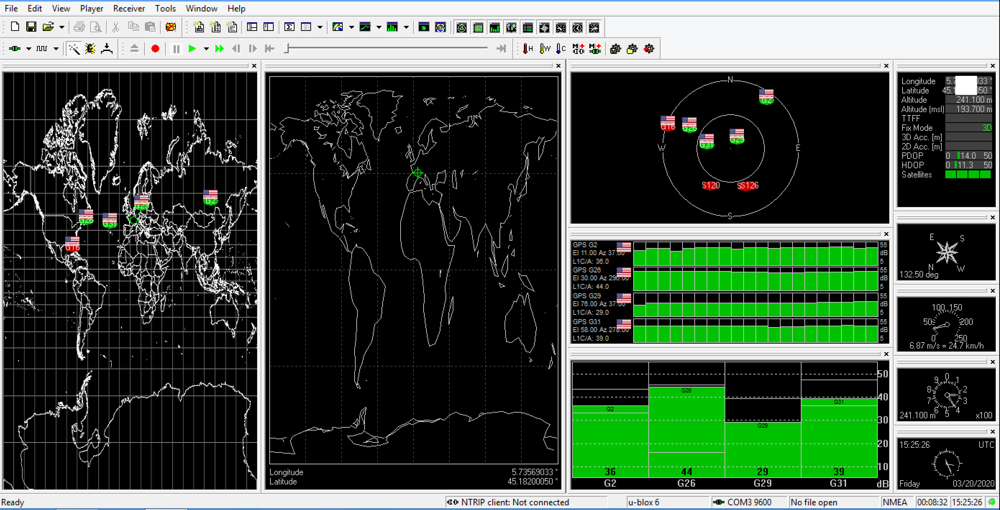
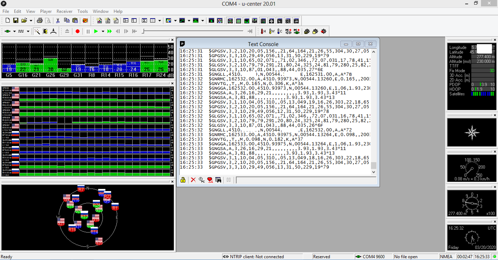

# GNSS modules for balloon tracking

According [CoCom](https://en.wikipedia.org/wiki/CoCom) regulations, most of commercial GPS modules stop at altitudes higher than 18000 meters and for speeds higher than 1000 knots (1852 km/h).

## Quectel

### Quectel L80 GPS Module
* https://www.quectel.com/product/l80.htm
* https://www.gotronic.fr/art-shield-lora-et-gps-113990254-27806.htm#complte_desc
* 14 euros chez RS https://fr.rs-online.com/web/p/puces-gps-et-modules-gps/9084085/
* 7 USD chez Avnet https://www.avnet.com/shop/us/products/quectel-wireless-solutions/l80-m39-3074457345626708837/

### Quectel L76-L GPS Module

* Balloon mode, for high altitude up to 80km
* Module on [Pycom PyTrack](https://github.com/pycom/pycom-libraries/tree/master/shields) and [Dragino LGT92](https://www.dragino.com/products/lora-lorawan-end-node/item/142-lgt-92.html)

* [Documents](https://www.quectel.com/product/gnss-l76/)

### Quectel L96-L GPS Module
* Balloon mode, for high altitude up to 80km
* embedded Mediatek MT3333 GNSS chip

## U-Blox

### U-Blox NEO-M8 series

* https://www.u-blox.com/en/product/neo-m8-series¨
* https://www.u-blox.com/en/positioning-chips-and-modules#tab-standard-precision-gnss

#### U-Blox SAM-M8Q
    up to 50000 m
    
* https://www.sparkfun.com/products/15210
* https://cdn.sparkfun.com/assets/4/e/b/9/f/SAM-M8Q_DataSheet__UBX-16012619_.pdf
* https://cdn.sparkfun.com/assets/5/d/d/2/3/SAM-M8Q_HardwareIntegrationManual__UBX-16018358_.pdf

### U-Blox NEO-M6 series

#### U-Blox NEO-6M-0-001

#### GY-NEO6MV2

> Note: The GY-NEO6MV2 modules available on Aliexpress require a 5V VCC and baudrate is 9600. 

#### ZED-F9P
* https://www.u-blox.com/en/product/zed-f9p-module
* [GPS RTK (Real Time Kinematics)@Sparkfun](https://learn.sparkfun.com/tutorials/what-is-gps-rtk/all)

## ADH

* http://www.adh-tech.com.tw

### ADH GP-635T

* up to 50000 m

* Sparkfun GP-735 https://www.sparkfun.com/products/13670 https://cdn.sparkfun.com/datasheets/GPS/GP-735T-150203.pdf
* https://www.generationrobots.com/media/GP-635T-121130-datasheet.pdf

## MediaTek

### MediaTek X1110

    80,000m maximum (Balloon mode)
    AT Command to Enter balloon mode : $PMTK886,3*2B<CR><LF>

* https://cdn.sparkfun.com/assets/parts/1/2/2/8/0/GlobalTop_Titan_X1_Datasheet.pdf
* https://www.sparkfun.com/products/14414
* https://learn.sparkfun.com/tutorials/sparkfun-gps-breakout---xa1110-qwiic-hookup-guide

## Stoton

### Stoton GN-801

    u-blox 8 UBX-M8030-KT chipset
    3.3V and 5V
    baudrate 9600
    The color of the wires are wrong (red and black) !!!!!
    
    
* http://www.stotoncn.com/gnssmodule/showproduct.php?lang=en&id=42
* http://www.stotoncn.com/upload/file/201801/1516180733487356.pdf

### Stoton GG-1802
    
    UBX-8030-KT chipset

* http://www.stotoncn.com/gnssmodule/showproduct.php?lang=en&id=63

## Globalsat

### Globalsat ET-662

    up to 18000m
    
* https://www.avrfreaks.net/sites/default/files/ET-662%20user%20manual%20V2.2.pdf

## Simcom

### Simcom SIM28

    Alimentation en 5V DC sur le platine [Grove GPS](http://wiki.seeedstudio.com/Grove-GPS/)
    Baudrate 9600 (et non 4800 par défaut)
    Altitude max 11000 m lors du vol depuis Valence

* https://www.tme.eu/Document/f3c28c977bbaeda48f88a1b8bb1a2a89/SIMCom%20Module%20%20EVB%20Kit.pdf
* https://www.tme.eu/Document/a5741a672d9b6a08eb0788fdbd1537f4/SIM28.pdf
* https://simcom.ee/documents/SIM28ML/SIM28ML_Hardware%20Design_V1.01.pdf
* http://www.vis-plus.ee/pdf/SIMCOM_SIM5350_ATC_EN_V1.02.pdf

## ST Microelectronics

### ST Teseo-LIV3F

    multiple constellations (GPS/Galileo/Glonass/BeiDou/QZSS).
    I2C, UART
    NMEA protocol
    mode ballon ?

* [Teseo-LIV3F Tiny GNSS module ](https://www.st.com/content/st_com/en/products/positioning/gnss-modules/teseo-liv3f.html)
* [X-NUCLEO-GNSS1A1 GNSS expansion board based on Teseo-LIV3F module for STM32 Nucleo](https://www.st.com/en/ecosystems/x-nucleo-gnss1a1.html)
* STEVAL-STRKT01 https://www.st.com/content/st_com/en/products/evaluation-tools/solution-evaluation-tools/communication-and-connectivity-solution-eval-boards/steval-strkt01.html
* https://stm32python.gitlab.io/fr/docs/Stm32duino/exercices/x-nucleo-gnss1a1

## Air530
* [Grove - GPS (Air530)](https://wiki.seeedstudio.com/Grove-GPS-Air530/) ([wiki](https://wiki.openluat.com/))

## AT6558R
[doc](https://www.icofchina.com/d/file/xiazai/2016-12-05/b1be6f481cdf9d773b963ab30a2d11d8.pdf)

in Dragino LGT92

```
$GPTXT,01,01,02,MA=CASIC*27
$GPTXT,01,01,02,IC=AT6558R-5N-52-1C580901*15
$GPTXT,01,01,02,SW=URANUS5,V5.3.0.0*1D
$GPTXT,01,01,02,TB=2020-03-26,13:25:12*4B
$GPTXT,01,01,02,MO=GR*67
```


## GNSS evaluation software for Windows
* https://www.u-blox.com/en/product/u-center




## See also
* [Stuart Robinson, Comparison of High Altitude Balloon GPSs](https://github.com/StuartsProjects/GPSTutorial/tree/master/GPS%20performance%20comparisons#high-altitude-balloon-gpss)
